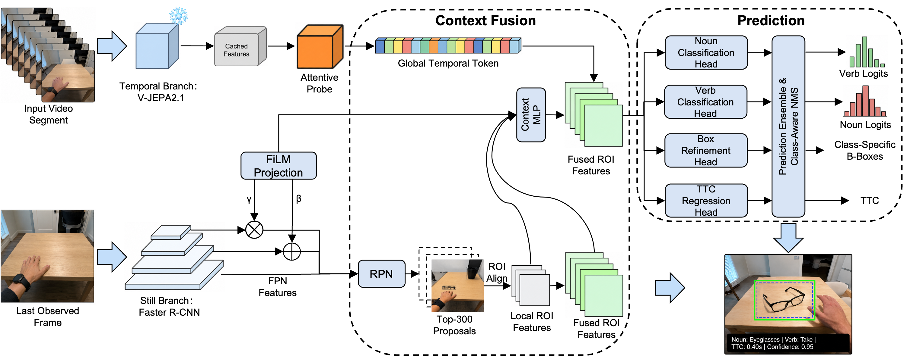
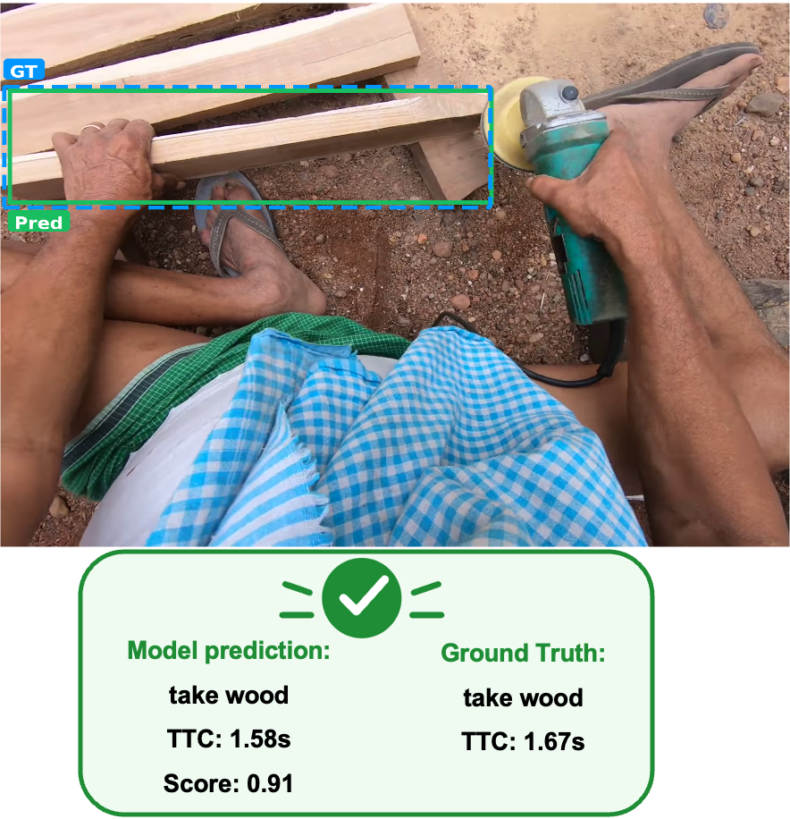
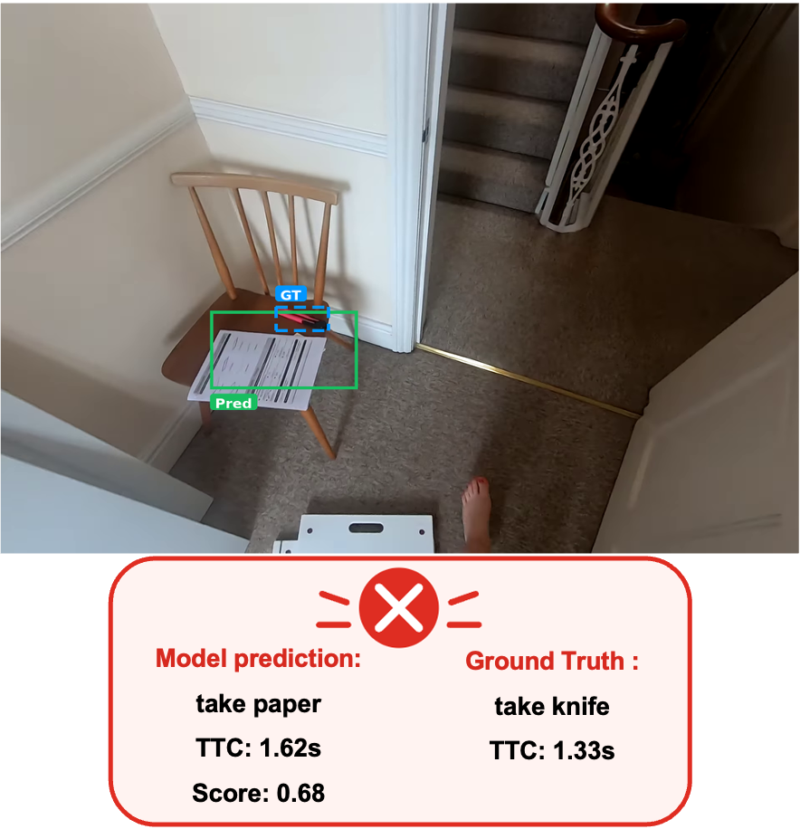

# VISTA for Ego4D STA Challenge @ EgoVis 2026

**VISTA** is the code scaffold for our **champion solution** in the
Ego4D Short-Term Object Interaction Anticipation Challenge @ EgoVis 2026.

VISTA stands for **V**-JEPA **I**ntegrated **S**tillFast **T**emporal
**A**nticipator. The system keeps the object-centric strength of a still-image
detector and injects frozen video context from V-JEPA 2.1 before predicting the
next active object, noun, verb, and time-to-contact.

## Result

Official test-set leaderboard, ranked by Overall Top-5 mAP:

| Rank | Participant | Overall | Noun | Noun+Verb | Noun+TTC |
| ---: | --- | ---: | ---: | ---: | ---: |
| **1** | **corrine (ours)** | **5.40** | **27.26** | **16.15** | 8.95 |
| 2 | sun0710 | 5.13 | 23.83 | 14.52 | 8.07 |
| 3 | StillFast Baseline V2 | 5.12 | 25.06 | 13.29 | **9.14** |
| 4 | Faster R-CNN + SlowFast Baseline V2 | 3.61 | 26.15 | 9.45 | 8.69 |

Competition page: <https://www.codabench.org/competitions/14477/>


## Method Overview




## Repository Layout

```text
.
├── README.md
├── LICENSE
├── requirements.txt
├── configs/
│   ├── vista_train.yaml
│   └── vista_test.yaml
├── docs/
│   └── figures/
│       ├── method.png
│       ├── success_case.png
│       └── failure_case.png
├── scripts/
│   ├── prebuild_sta_cache.sh
│   ├── extract_vjepa_features.sh
│   ├── train_vista.sh
│   ├── infer_vista.sh
│   └── ensemble_vista.sh
├── evals/
│   ├── main.py
│   ├── scaffold.py
│   └── vista_sta/
│       ├── eval.py
│       ├── ego4d_sta.py
│       ├── dataloader.py
│       ├── models.py
│       ├── losses.py
│       ├── utils.py
│       ├── extract_jepa_global_features.py
│       ├── ensemble_head_predictions.py
│       ├── dynamic_metric_head_ensemble.py
│       └── run_official_metric_only.py
└── src/
    └── minimal V-JEPA model support code
```

| File | Purpose |
| --- | --- |
| `configs/vista_train.yaml` | Train+val configuration for the 4-head VISTA model. |
| `configs/vista_test.yaml` | Test inference configuration that dumps all prediction heads. |
| `evals/vista_sta/models.py` | Faster R-CNN still branch, V-JEPA temporal branch, FPN/ROI fusion, STA heads. |
| `evals/vista_sta/ego4d_sta.py` | Ego4D STA frame-directory dataset and manifest cache builder. |
| `evals/vista_sta/eval.py` | Distributed train/eval loop, checkpointing, and prediction dumping. |
| `evals/vista_sta/dynamic_metric_head_ensemble.py` | Final metric-aware confidence consensus ensemble and ZIP writer. |
| `docs/figures/` | Method and qualitative examples from the technical report. |

## Setup

Install Python dependencies:

```bash
pip install -r requirements.txt
```

Prepare external paths:

```bash
export EGO4D_STA_ROOT=/path/to/Ego4D/v2
export VJEPA_CHECKPOINT=/path/to/vjepa2_1_vitG_384.pt
export VISTA_CHECKPOINT=/path/to/vista_epochXXX.pt
```

`EGO4D_STA_ROOT` is expected to contain:

```text
frames_of_video_sta_2fps/
├── train/
├── val/
└── test_unannotated/
fho_sta_val.json
```

If you have a local COCO Faster R-CNN checkpoint, set:

```bash
export DETECTOR_WEIGHTS=/path/to/fasterrcnn_resnet50_fpn_coco.pth
```

Otherwise torchvision's COCO weights are used when available.

## Step 1: Build Ego4D STA Manifest Cache

```bash
scripts/prebuild_sta_cache.sh
```

This writes lightweight JSON caches under `outputs/cache/`. The cache prevents
each distributed worker from repeatedly scanning the Ego4D frame folders.

## Step 2: Cache V-JEPA Global Features

VISTA uses cached V-JEPA features for the final training/inference path:

```bash
scripts/extract_vjepa_features.sh
```

For multi-GPU or multi-node extraction, shard the dataset:

```bash
NUM_SHARDS=8 SHARD_ID=0 scripts/extract_vjepa_features.sh
NUM_SHARDS=8 SHARD_ID=1 scripts/extract_vjepa_features.sh
```

Cached features are written to:

```text
outputs/jepa_global_cache_vjepa8f/
```

## Step 3: Train VISTA

```bash
DEVICES="cuda:0 cuda:1 cuda:2 cuda:3" scripts/train_vista.sh
```

## Step 4: Run Test Inference

Point `VISTA_CHECKPOINT` to the trained checkpoint:

```bash
export VISTA_CHECKPOINT=/path/to/epoch-XXX.pt
DEVICES="cuda:0 cuda:1" scripts/infer_vista.sh
```

This writes rank-level and merged prediction JSON files to:

```text
outputs/test_epochXXX_allheads/
```

Expected merged files for final ensembling:

```text
epoch_XXX_merged.json
epoch_XXX_head1_merged.json
epoch_XXX_head2_merged.json
epoch_XXX_head3_merged.json
```

## Step 5: Ensemble and Package Submission

```bash
scripts/ensemble_vista.sh
```

The final files are:

| Output | Description |
| --- | --- |
| `outputs/test_epochXXX_allheads/vista_dynamic_metric_ensemble.json` | Final STA prediction JSON. |
| `outputs/test_epochXXX_allheads/vista_dynamic_metric_ensemble.zip` | Codabench upload archive. |
| `outputs/test_epochXXX_allheads/vista_dynamic_metric_ensemble_summary.json` | Ensemble diagnostics. |

The ensemble groups predictions by noun, verb, box IoU, and TTC proximity, then
merges compatible hypotheses with dynamic per-sample head weights.

## Qualitative Examples

<p align="center">
  
  
</p>

## Local Validation

Evaluate a validation prediction JSON with the local Ego4D STA metric:

```bash
python3 -m evals.vista_sta.run_official_metric_only \
  outputs/val_predictions.json \
  ${EGO4D_STA_ROOT}/fho_sta_val.json
```

Check the final fusion path with compatible head-level JSON files:

```bash
python3 -m evals.vista_sta.dynamic_metric_head_ensemble \
  --inputs outputs/test_epochXXX_allheads/epoch_XXX_merged.json \
           outputs/test_epochXXX_allheads/epoch_XXX_head1_merged.json \
           outputs/test_epochXXX_allheads/epoch_XXX_head2_merged.json \
           outputs/test_epochXXX_allheads/epoch_XXX_head3_merged.json \
  --output outputs/test_epochXXX_allheads/vista_dynamic_metric_ensemble.json \
  --zip-output outputs/test_epochXXX_allheads/vista_dynamic_metric_ensemble.zip
```

## License

This repository is released under the MIT License. See [LICENSE](LICENSE).
External datasets, V-JEPA checkpoints, and detector weights are not included
and remain under their respective licenses.
